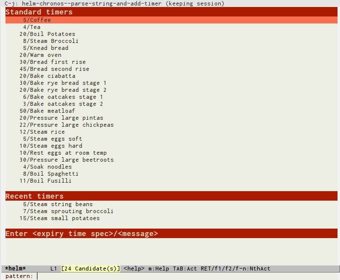
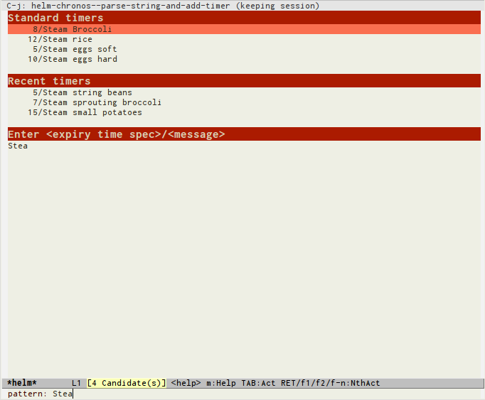

# Helm-chronos

A Helm interface to chronos, the multiple countdown/countup timer
package for Emacs https://github.com/dxknight/chronos.

# Installation

## Old school

Ensure already have `helm` and `chronos` installed.

Put `helm-chronos.el` somewhere Emacs can find it and evaluate `(require
'helm-chronos)`.

## MELPA

If you have set up access to MELPA http://melpa.org/#/getting-started, you can
install using:

`M-x package-install helm-chronos`.

## MELPA/use-package

If you have MELPA and `use-package` https://github.com/jwiegley/use-package,
you can install by evaluating:

`(use-package helm-chronos :ensure t)`

Adding that snippet to your init file if you want helm chronos for future sessions.

## Quick start

`M-x helm-chronos-add-timer` will pop up a helm interface to match the pattern
you enter against predefined timers.  If no timer matches your pattern, a timer
definition can be entered directly and will be remembered for this and future
sessions.

In helm-chronos, the format for timers is a string consisting of a chronos
expiry time specification and a message, separated by /.  For example:
"5/Coffee" would be for a timer expiring in five minutes with the message
"Coffee".  See the `chronos` documentation for more details on expiry time
specifications.

Setting a timer relative to another timer's expiry (rather than current time) is
done by selecting the timer and using the prefix argument, as with standard
`chronos`.  However, remember that with `helm`, the `C-u` is entered when
already in the helm interface, not before calling it up.

## Configuration

No configuration is necessary, but you will probably want to bind
`helm-chronos-add-timer` to a handy key combination, and you may want to set
`helm-chronos-standard-timers` to a list of time/message strings useful to your needs.

See `M-x customize-group` helm-chronos for other customizable items.

If you use `use-package`, you can conveniently put the customization in your init
file, for example:

    (use-package helm-chronos
      :ensure    t
      :init      (setq helm-chronos-standard-timers
                       '( "     5/Coffee"
                          "     4/Soak noodles"))
      :bind      (("C-c t" . helm-chronos-add-timer)))

# Example

I want to steam some asparagus.  I have already defined some standard timers in
the list `helm-chronos-standard-timers`, and there are a few recent timers I
entered in this or previous sessions.

I narrow the selections by starting to type `steam`.  By the time I get to
`stea`, I can see there is no steamed asparagus timer available.

I go to the start of the search pattern and clear it with `C-a C-k`, then enter
a suitable timer specification of six minutes to steam the asparagus: 6/Steam
asparagus.  After pressing enter, the timer is started.

The next time I call `helm-chronos-add-timer`, I see that 6/Steam asparagus has
been included as a recent timer.

